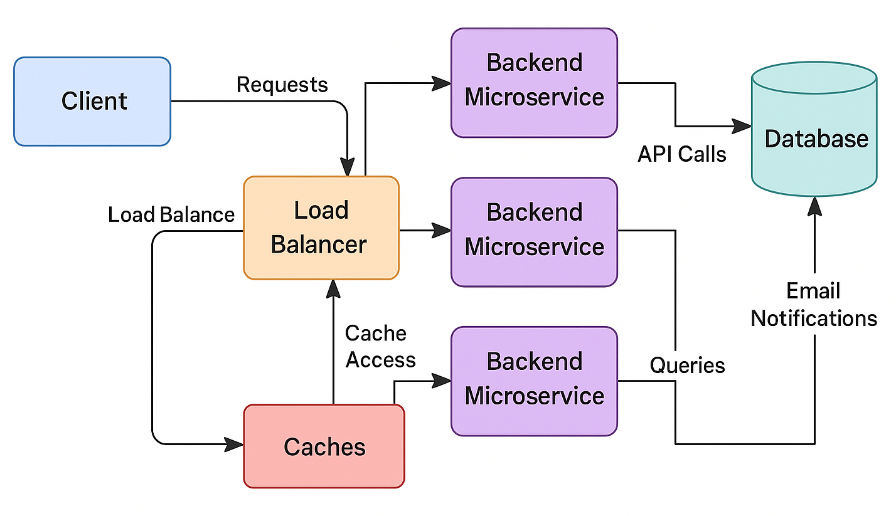

# System Map

## Overview
The Task Management System is built using a **3-tier architecture** consisting of the **Frontend**, **Backend**, and **Database**. 

Each component communicates with the others through well-defined interfaces to ensure scalability, flexibility, and maintainability.

### Major Components:
1. **Frontend (ReactJS)**:
   - The **Frontend** is built using **ReactJS**. It serves as the client-side interface, handling user interactions and sending requests to the backend.
   - It sends HTTP requests (via **Axios** or **Fetch API**) to the Backend to create tasks, update task status, and fetch task lists.
   - The Frontend is also responsible for handling user authentication, rendering task data, and displaying notifications.

2. **Backend (Python - Flask/Django)**:
   - The **Backend** is built using **Python**, and can be implemented using either **Flask** or **Django**.
   - **Flask**: Lightweight and flexible, used for handling APIs and business logic.
   - **Django**: A full-fledged web framework that comes with built-in features like admin, authentication, and ORM (Object-Relational Mapping).
   - The Backend processes incoming requests from the Frontend, interacts with the database, and sends responses. It may also trigger email notifications or handle caching using a load balancer.

3. **Database (MySQL, SQLAlchemy)**:
   - The **Database** is a **MySQL** relational database, managed with **SQLAlchemy** ORM.
   - It stores data related to tasks, users, and other application-specific information.
   - SQLAlchemy abstracts the database queries, allowing the Backend to interact with the database using Python objects.

## Data Flow
- **Frontend to Backend**: The ReactJS Frontend sends **HTTP requests** to the Backend for user actions such as task creation, updates, or deletions.
- **Backend to Database**: The Backend queries or updates the MySQL database using SQLAlchemy to store and retrieve task data.
- **Backend to Email Service**: The Backend sends requests to an **Email Service** for user notifications (e.g., task deadlines).
- **Backend to Cache**: The Backend checks the **cache** before querying the database to improve response times.

## Key Constraints
1. **Scalability**: The system needs to handle a large number of users and tasks efficiently, requiring load balancing between the Backend microservices.
2. **Performance**: The database queries must be fast, and **caching** is employed to avoid frequent database hits for frequently accessed data.
3. **Security**: The system must ensure secure communication between the Frontend and Backend, with proper user authentication and authorization.
4. **Data Consistency**: SQLAlchemy ensures data consistency through **transactions** when multiple queries are executed in one go.

## Diagram
