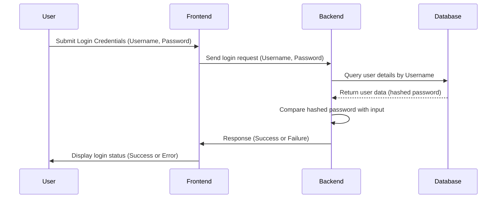

# MkDocs Task

This is the **landing page** of my project documentation.

---

## Quick Links:
- [About Us](about.md)
- [Contact Us](contact.md)

---

## Commands

* `mkdocs new [dir-name]` - Create a new project.
* `mkdocs serve` - Start the live-reloading docs server.
* `mkdocs build` - Build the documentation site.
* `mkdocs -h` - Print help message and exit.

## Project layout

    mkdocs.yml      # The configuration file.
    docs/
        img/
            Design Mind Map using Xmind.png
            Web Application Architecture using drawio.png
        index.md    # The documentation homepage.
        about.md    # The documentation about page.
        contact.md  # The documentation contact page.

## Diagram Section:

### 1. Login Flow Diagram

### 2. Web Application Architecture

### 3. Design Document Mind Map
